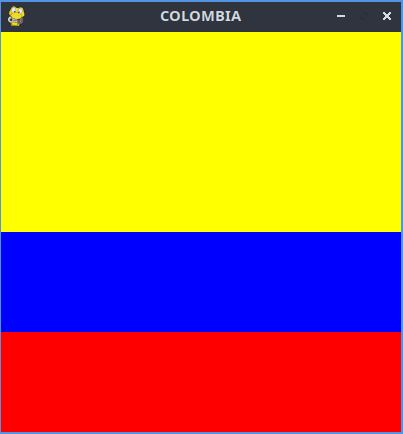

# Estructura de datos un juego pygame.

## Inicializacion

- Como todo programa en python se debe importar los modulos al utilizar. 
```import pygame```

- Iniciar pygame usando ```init()``` inicia los modulos pygame importados.
``` pygame.init() ```

### Ventana

``` ventana = pygame.display.set_mode((600, 400))```

 ```Set_mode```
 es para definir la pantalla. por 600 x 400 px, en la pantalla. 

 ``` pygame.display.set_caption("Mi ventana") ```

- `set_caption()` es el que hace un nombre a la ventana.

### funcion set_mode()

`set_mode(size =(0, 0), flags = 0, depth = 0, display = 0)`

- size = (600, 400) : define el tamañano de la ventana

- flags: Define uno de los comportamientos de la ventana.
     - Valores:
       - pygame.FULLSCREEN
       - pygame.RESIZABLE
    - Ejemplos:
       - flags = pygame.FULSCREEN | pygame
       - Resizable: pantalla completa, dimensiones modificable.

## Bucle del juego - game loop
- Bucle infinito que se interrumpe cuando se cumple cierto criterios.
- Hay un relog interno del juego. 
- En cada interaccion del bucle del juego, podemos mover a un personaje por ejemplo. 

Mover a un personaje o tener en cuenta uno del otro, lo que quiere decir que a terminado

- Cada interacion es una oportunidad para actualizar, todo los datos. relacionado con el estado actual de la partida. 

- En cada iteraccion se realiza la siguente tareas.
   1. Comprobar que no se alcanza elas condicones parada. en cuyo caso se interrumpe el bucle
   2. Actualizar los recursos necesarios para la interaccion actual.
   3. Obtener las entradas del sistemas o de que interaccion del jugador.
   4. Actualizar todas las entidades que se caracterizan el juego.
   5. Refrescar la pantalla.


## Superficie pygame
- Superficie:
    - Elementos geometrico.
    - Linea, poligono, imagen, texto que se muestra en pantalla. 
    - El poligono se puede o no rellenar de color.
    - La superfice se crean de diferente manera dependiendo el tipo.
    - Imagen: imagee.load()
    - texto: font.render()
    - Superficie generica: pygame.Surface()
    - Ventana del juego: pygame.dispay.set_mode()

# Juego Vandera Colombia



### Codigo: 

```Python
import pygame

pygame.init()

pygame.display.set_caption("COLOMBIA")

#Colores 
amarillo = (255, 255, 0)
azul = (0, 0, 255)
rojo = (255, 0, 0)

rojo_superfice = pygame.Surface((400, 100))
rojo_superfice.fill(rojo)

azul_superfice = pygame.Surface((400, 100))
azul_superfice.fill(azul)


amarillo_superficie = pygame.Surface((400, 200))
amarillo_superficie.fill(amarillo)

Ventana = pygame.display.set_mode((400, 400))
Ventana.blit(amarillo_superficie, (0,0))
Ventana.blit(azul_superfice, (0,200))
Ventana.blit(rojo_superfice, (0,300))


pygame.display.flip()


while True:
    event = pygame.event.wait()
    if event.type == pygame.QUIT:
        break

pygame.quit()
```
