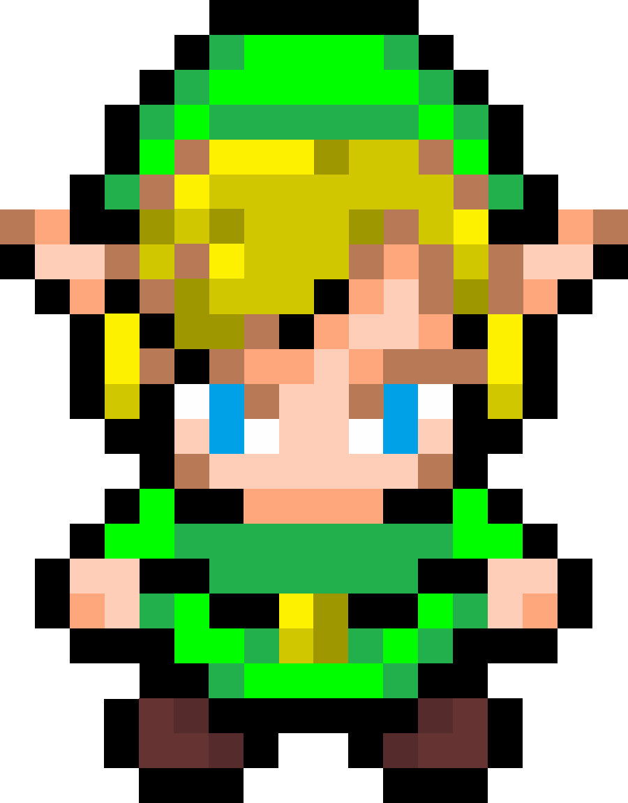
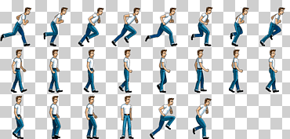

# Que es un sprite 

- En el ámbito de los videojuegos, los sprites son un conjunto de imágenes que representa un personaje u objeto (o una parte de ellos) de manera gráfica y que se utiliza para poder crear cualquier efecto de movimiento o para cambiar su estado o posición en la escena. 

###  pygame: 
- Se usan para poner a un personaje, que pueda interactuar y poder darle vida, atra vez de animaciones. Lo mismo que lo anteriormente mencionado. 

# Ejemplo. 

# Dimensiones

- Cuando creamos un sprite de nuestro personaje. Puede tener dimesiones, la mas usada y universal es la de 16x16. Donde el sprite tendra 16x16 en ancho. En pocas palabras seria una imagen con 256 pixeles, de ancho.

# Softwares para hacer sprites.

- Gimp
- Photoshop
- Asesprite

# Hacer una animacion, Correr. 

- Cuando queremos hacer una animacion con sprite. Se necesita hacer uso de plantillas. Las plantillas es lo que se usa para guarda cada sprite que va representar la animacion. Es como si fueran los fotogramas de una pelicula o serie animada.

- Cada uno de estos sprite. Pueden tener sus dimenciones que en su mayoria mide 16x16 cada sprite. 

